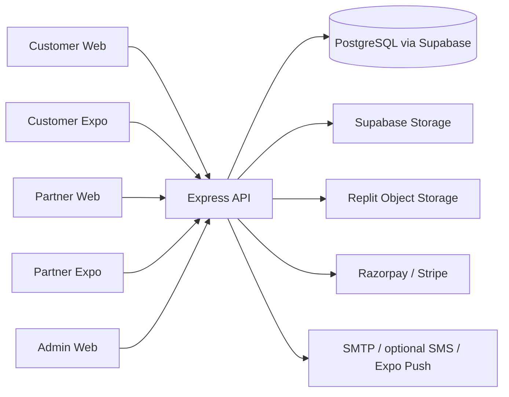
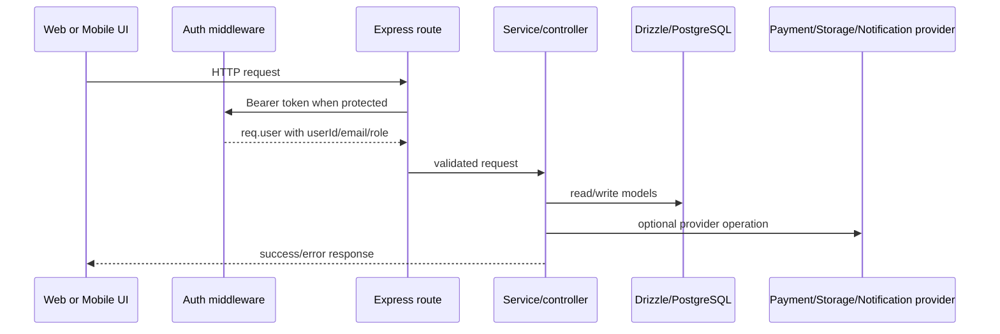

# Architecture

## Overall shape

The repository is a pnpm monorepo. Three Vite web applications and two Expo
applications consume one Express/TypeScript backend. The backend owns
authentication, authorization, validation, business services, persistence,
payment callbacks, uploads, and notifications.

## Backend flow

`server/src/index.ts` runs `runMigrations()`, creates the app, listens on
`env.PORT`, starts the in-process payout scheduler, and starts avatar bucket
setup in the background. `server/src/app.ts` applies Helmet, CORS, JSON/raw
body parsing, logging, API cache headers, rate limiting, routes, production
static serving, QR serving, and error handlers.

The API route tree is mounted below `/api` by
`server/src/routes/index.ts`. Controllers call services and repositories; the
services use Drizzle through `server/src/config/database.ts`.

## Frontend and mobile

- Vite web apps keep their own entrypoint, API helper, styles, and application
  component. Customer Web shares types/constants from `packages/shared`.
- Expo applications use Expo Router layouts and route files. Each mobile app
  has its own auth context, storage, query client, API helper, push-notification
  helper, and Metro configuration.
- Production Express serves the built customer app at `/`, admin app at
  `/admin-panel`, and partner app at `/partner`.

## Request/data flow

## Authentication and authorization

JWT access tokens are verified locally. The payload-derived user identity is
attached to `req.user`; `requireRole` compares its role against the allowed
role list without a database lookup. Refresh tokens are persisted in
`refresh_tokens`. See [`05-AUTHENTICATION-AUTHORIZATION.md`](05-AUTHENTICATION-AUTHORIZATION.md).

## Database architecture

The primary domain is PostgreSQL. Drizzle table definitions are in
`server/src/database/schema/`. The model contains legacy `bookings` and
`booking_items`, and newer `orders`, `order_items`, and per-item request/payment
tables. Foreign keys and delete actions are defined in the schema files.

## Background work

The payout scheduler is an in-process interval/claim mechanism in
`server/src/services/payoutScheduler.service.ts`. No separate queue worker,
Bull, Agenda, or node-cron integration was found.

## Error and security layers

The API uses Zod validators, `authenticate`, `requireRole`, route-specific rate
limiters, Helmet, CORS, raw-body capture for payment signatures, no-store API
responses, centralized not-found/error middleware, and structured logging.
Exact production CORS policy and webhook registration are
`UNKNOWN — REQUIRES VERIFICATION`.
