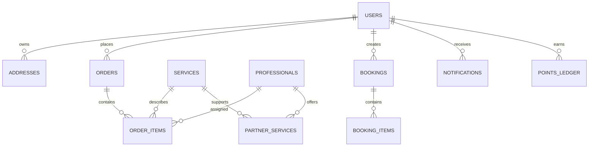

# Database

## Database and ORM

The application uses PostgreSQL through Supabase and Drizzle ORM. The source
of truth for application models is `server/src/database/schema/`. The schema
barrel is `server/src/database/schema/index.ts`; startup migration logic is
`server/src/database/migrate.ts`.

## Core identity and access tables

- `users` — email, phone, password hash, full name, avatar, role,
  verification timestamps, active state, push token, and lifecycle timestamps.
  Role enum: `customer`, `partner`, `admin`, `operations_manager`.
- `refresh_tokens` — persisted refresh-token records used by auth refresh and
  logout flows.
- `otp_codes` — OTP records used by signup/password recovery.
- `addresses` — user-owned address records with city/state/postal data,
  optional latitude/longitude, default flag, and soft deletion.
- `professionals` — partner profile, availability/location, payout and
  operational data. Exact full column inventory is in
  `server/src/database/schema/professionals.ts`.

## Catalog tables

- `service_categories` — top-level service catalog categories.
- `sub_service_categories` — category-owned subcategories with image,
  ordering, featured, active, and soft-delete fields.
- `services` — bookable service products with category linkage, duration,
  customer pricing, partner payout/commission data, and active/catalog fields.
- `partner_services` — unique partner-to-service capability join.
- `offers` — promotional content, scheduling, ordering, visual metadata, and
  active/deleted state.
- `reels` — video content with service-category linkage, publication windows,
  ordering, featured flag, and view/click counters.

## Legacy booking tables

- `bookings` — legacy booking record. Fields include customer, optional
  professional, category, address, service/pro names, scheduled time, status,
  price, notes, assignment/dispatch fields, review flag, and lifecycle dates.
  Status enum: `pending`, `upcoming`, `in_progress`, `completed`, `cancelled`.
- `booking_items` — multiple service lines attached to one legacy booking,
  including quantity, customer price, partner payout, line total, and duration.
- `booking_partner_requests` — partner broadcast/response records for a booking.
- `booking_assignment_logs` — assignment actions and actor records.

## New order tables

- `orders` — master customer order with customer/address, scheduled time,
  aggregate amount, notes, timestamps, and status.
  Status enum: `created`, `searching_partners`, `partially_confirmed`,
  `fully_confirmed`, `in_progress`, `partially_completed`, `completed`,
  `cancelled`.
- `order_items` — one service item in an order. Stores service, optional partner,
  item status, scheduled time, duration, customer price, partner payout,
  quantity, cancellation fields, and completion time.
  Status enum: `searching_partner`, `assigned`, `partner_accepted`,
  `partner_arrived`, `payment_pending`, `payment_completed`, `service_started`,
  `service_completed`, `cancelled`.
- `order_item_requests` — per-item partner dispatch requests.
- `order_item_payments` — payment state associated with an order item.

## Money, operations, and communication

- `payments` — legacy booking-level payment record with amount, currency,
  payment status/provider/method metadata, provider identifiers, and signature.
  Payment status enum: `created`, `paid`, `failed`, `refunded`.
- `payout_requests` — partner payout request with status, amount, provider
  fields, resolution timestamps, and failure details.
- `payout_runs` — batch payout execution counters and lifecycle state.
- `partner_job_evidence` — before/after evidence URLs linked to partner,
  booking and/or order item.
- `notifications` — user notification title/body/type/read state and JSON data.
- `support_tickets` — customer support issue, optional booking/order-item link,
  priority, status, response, and timestamps.
- `audit_logs` — admin action, target, metadata, and timestamp.

## Customer engagement and platform content

- `favorites` — user favorites.
- `service_wishlists` — user service wishlist records.
- `reviews` — customer reviews linked to completed work.
- `points_ledger` — earn/redeem/adjust entries linked to user and optionally
  booking. Points entry enum: `earn`, `redeem`, `adjust`.
- `platform_policies` — unique slug and editable policy content.
- `platform_settings` — unique key/value settings used for runtime configuration.

## Relationships

Foreign keys and delete actions are defined in the individual schema files.
Explicit unique/index definitions are present for partner-service pairs,
platform keys/policy slugs, and active offers. Other indexes or database-level
constraints not visible in the TypeScript definitions are
`UNKNOWN — REQUIRES VERIFICATION`.

## Migrations and seeds

- Startup: `server/src/database/migrate.ts`
- Generated migration: `server/src/database/migrations/0000_public_mole_man.sql`
- Catalog: `seed-catalog.ts`, `seed-service-details.ts`
- Partner links: `seed-partner-services.ts`
- Test data: `seed-test-accounts.ts`, `seed-test-mode.ts`

Do not run migrations or seeds merely to inspect this documentation.
